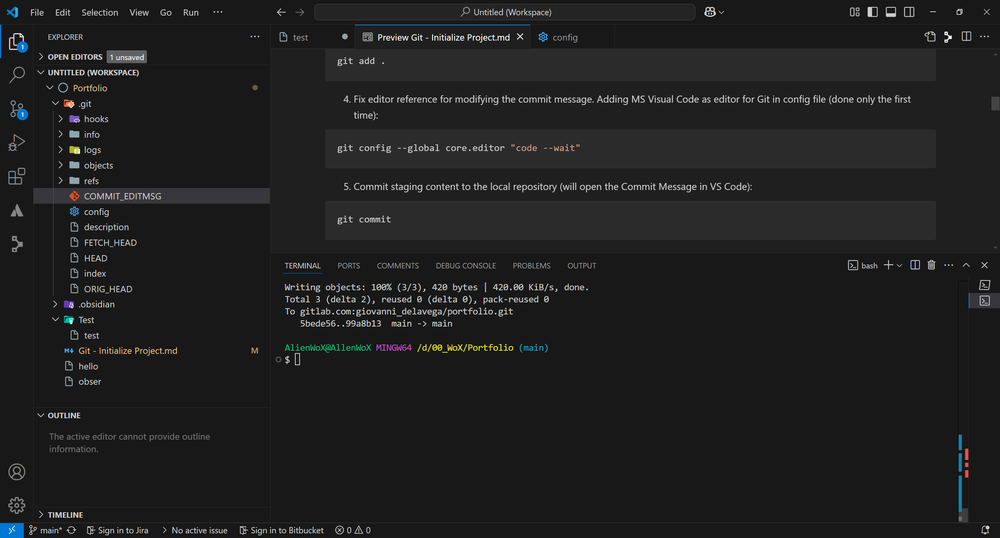

#### **Connect Securely Git Provider Account With Local**

1. Inspect if the `id_rsa` and `id_rsa.pub` files exist

```bash
ls ~/.ssh
```

2. If there are not those files, use next command for generate new key pair:

```bash
ssh-keygen -t rsa -b 4096 -C "Giovanni_delaVega@gmx.com"
```

3. Get key, and copy the output:

```bash
cat ~/.ssh/id_rsa.pub
```

1. Paste the key into the Git cloud provider platform. 

2. Corroborate SSH connection with Git cloud repo:

```bash
ssh -T git@gitlab.com
```

#### **Create and Connect Local Git Repo**

1. Check Git status:

``` bash
git status
```

2. Initialize Git:

```bash
git init
```

3. Add all the repository into the staging area:

```bash
git add .
```

4. Fix editor reference for modifying the commit message. Adding MS Visual Code as editor for Git in config file (done only the first time):

```bash
git config --global core.editor "code --wait"
```

5. Commit staging content to the local repository (will open the Commit Message in VS Code):

```bash
git commit
```

- Or commit without editing the commit message:

```bash
git commit -m "Your Own Commit Message"
```

> [!WARNING] If the commit message is in blank, it will abort the commit action.

6. Connect local Git repository with Git remote repository (GitHub, GitLab, Bitbucket, etc.)

```bash
git remote add origin git@gitlab.com:giovanni_delavega/portfolio.git
```

> [!INFO] The URL of remote repo is gotten from the Git cloud provider, where is stored the remote project.

7. Push the local changes to the remote repo:

```bash
git push
```

> [!ERROR] It will fail, since the local and remote master branches are not connected.

- If fails, use:

```bash
git push -u origin master
```

> [!INFO] The flag `-u` is an alias of the option `--set-upstream`, both perform same action: connect local master branch with remote master branch. 
> Next time that be used a `push` or `pull` git command, won't be needed to specify the remote branch. 

8. If is needed to change the branch which associates the local repo, use:

```bash
git branch --set-upstream-to=origin/main
```

> [!INFO] GitLab uses the branch `main` has the main and protected branch, not the `master`. Hence, any push made to `main`, will be reflected directly in the main repo, and immediately visible for public without needed to make any Merge Request. 

#### **Create Local `main` Branch**

GitLab uses the `main` branch as the default branch, since the local Git repo uses `master` as the default branch. Might be needed to create locally the `main` branch, then merge the branches and finally destroy the master branch for keeping only one. 

1. Verify if the `main` branch is listed from remote repo. Get info from remote:

```bash
git fetch origin
git branch -r
```

- The `main` branch should be listed.

2. Create the `main` branch locally:

```bash
git checkout -b main --track origin/main
```

3. Might be needed to merge branches locally if is wanted to keep only one:

```bash
git checkout main
git merge master
```

4. Could be needed to revert any staged change, use:

```bash
git stash
```

5. Validate available branches in local and remote:

```bash
git branch -vv
```

6. Check the status, it should say: `On branch main Your branch is up to date with 'origin/main'.`

```bash
git status
```

#### **Merge Remote Branches**

1. In the Git Cloud Provider portal, request a branch merge. 

2. Proceed with approvals for merging branches. 

#### **Pull Changes from Remote Repo**

1. Locate into the branch wanted to update:

```bash
git checkout main
```

2. Download the changes and merge them into your local:

```bash
git pull origin main
```

#### **(Optional) Pull Changes Without Merge Them**

1. Download the changes without merge them with your local:

```bash
git fetch origin
```

2. Then, you can review the changes with:

```bash
git log origin/main
```

3. If you want to merge them, use:

```bash
git merge origin/main
```

Blue: `NOTE`
Green: `TIP`
Red: `WARNING`
Yellow: `CAUTION`
Purple: `IMPORTANT`

> [!NOTE] Title
> Contents

> [!important] Title
> - wefref
> - -e-vfre
> 1. erfrf
> 2. refrf

> [!warning] Title
> Contents

> [!caution] Title
> Contents

> [!tip] Title
> Contents

[[./Example Image.png]]
![[Example Image.png]]

[[https://gitlab.com/giovanni_delavega/portfolio/-/blob/main/Example%20Image.png?ref_type=heads]]

![[https://gitlab.com/giovanni_delavega/portfolio/-/blob/main/Example%20Image.png?ref_type=heads]]

[image](ExampleImage.png "Hello World")


[How do I display local image in markdown? - Stack Overflow](https://stackoverflow.com/questions/41604263/how-do-i-display-local-image-in-markdown)
